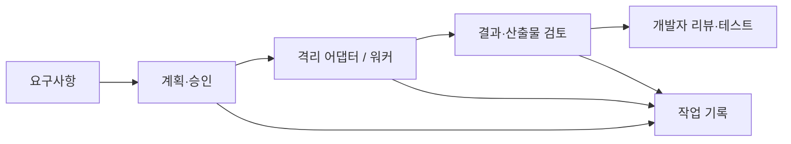

# AI Development Tool

**Experimental** · AI-assisted software engineering · 검증 가능한 개발 프로세스

AI가 생성한 코드를 작업 승인·실행 기록·결과 검토·테스트가 있는 개발 프로세스 안에 넣는 도구입니다.
Jarvis 실행 코드와 검증 도구를 개발하고 있으며 완전 자율 개발이나 모든 환경에서의 안전한 실행을 보장하지 않습니다.

## 문제와 내가 한 일

AI의 출력만으로는 실제 파일이 바뀌었는지, 요구사항을 충족했는지, 실행 결과를 다시 확인할 수 있는지 알기 어렵습니다.
작업 계획과 승인, 워커 실행, 산출물 확인과 기록을 나누고 각 경계를 테스트로 확인하는 구조를 구현했습니다.

AI agent는 코드 생성과 반복 작업에 활용합니다. 요구사항 정의·설계 판단·리뷰·테스트·검증은 개발자의 책임으로 둡니다.

## 현재 구현과 근거

| 구현 | 소스 / 검증 |
| --- | --- |
| 작업 계획·승인·워커 실행 | [orchestrator](src/jarvis/orchestrator.py), [승인 게이트](src/jarvis/approval.py), [테스트](tests/jarvis/test_approval_gate.py) |
| 결과 검토 | [ReviewGuard](src/jarvis/review.py)는 알려진 위험 명령 패턴을 검사합니다. [테스트](tests/jarvis/test_review_guard.py) |
| 작업 기록과 대화 저장 | [JSONL 작업 기록](src/jarvis/ledger.py), [대화 저장소](src/jarvis/conversation_repo.py) |
| 실행 환경 분리 | [격리 어댑터](src/jarvis/isolation.py), [Landlock 구현](src/jarvis/sandbox), [환경별 테스트](tests/jarvis/test_isolation.py) |
| 개발 과정 검증 | [비밀정보 패턴 검사](tools/secret_scanner.py), [스키마 검증](tools/schema_validator.py), [증거 표기 검사](tools/evidence_pass_gate.py) |

`main`은 안정 기준, `develop`은 개발 통합 브랜치입니다. 이 설명은 양쪽에서 확인할 수 있는 위 구현을 중심으로 작성했습니다.
`develop`의 추가 기능과 설계 문서에만 있는 목표를 기본 브랜치의 완료 기능으로 간주하지 않습니다.

## Architecture · 기술 선택



- **Python**: 실행 도구·검토 규칙·테스트를 같은 언어에서 연결합니다.
- **JSONL / SQLite**: 작업 이벤트와 대화 정보를 저장합니다. 기록이 있다는 사실만으로 결과의 정확성을 보증하지 않습니다.
- **pytest / pre-commit / GitHub Actions**: 반복 가능한 검사를 개발·커밋·PR 단계에 배치합니다.
- **Linux Landlock**: 실행 접근 범위를 제한하는 구현을 실험합니다. 커널·실행 환경에 의존하며 패턴 검사는 완전한 보안 경계가 아닙니다.

## 실행과 검증

Python 3.12 기준의 개발 의존성을 사용합니다. 먼저 [기여 가이드](CONTRIBUTING.md)의 개발 환경·hook 설치 절차를 확인하세요.

```bash
python3 -m venv .venv
source .venv/bin/activate
python -m pip install -r requirements-dev.txt
python -m pytest tests/jarvis/ -q
```

위 명령은 테스트 환경을 준비합니다. 실제 워커 실행에는 별도의 로컬 도구·모델·설정이 필요합니다. 테스트 실행만으로 외부 LLM을 사용하는 전체 개발 흐름이 재현된다고 설명하지 않습니다.

**설치 제약(2026-09-30 확인)**: 기존 `bin/setup.sh`는 `core.hooksPath`를 설정한 뒤 `pre-commit install`을 호출해 설치가 중단됩니다. 기여용 hook 설치는 이 충돌을 먼저 해소해야 합니다. 커밋 전 필수 검사를 생략해도 된다는 의미는 아닙니다.

- [Jarvis Tests CI](.github/workflows/jarvis-tests.yml)는 단위 테스트와 sandbox 컴파일을 수행합니다.
- sandbox 미빌드 상태에서 런타임 통합 테스트는 skip될 수 있습니다. CI의 컴파일 성공은 Landlock 런타임 격리 검증과 다릅니다.
- [전체 workflow](.github/workflows)와 [실행 결과](https://github.com/jokwangwon/AI_development_tool/actions)에서 검사 범위를 확인할 수 있습니다.
- 과거 실제 사용 검증은 [세션 기록](docs/sessions)에 남아 있습니다. 특정 사례의 성공을 일반적인 성공률로 확장하지 않습니다.

## 현재 상태와 한계

**Experimental** — 구현과 테스트가 있는 개인 개발 도구이며 범용 제품이나 프로덕션 운영 플랫폼으로 소개하지 않습니다.

ReviewGuard는 알려진 패턴만 탐지합니다. 문서의 검증 절차와 실제 실행 강제력은 다를 수 있으므로 코드·테스트·CI 결과를 함께 확인해야 합니다.
새로운 기능은 `feature/* → develop`에서 검토하며 `main` 반영은 별도 릴리스 결정에 따릅니다.

[문서 인덱스](docs/INDEX.md) · [현재 개발 상태](docs/CONTEXT.md) · [포트폴리오](https://gwangwon.dev)
